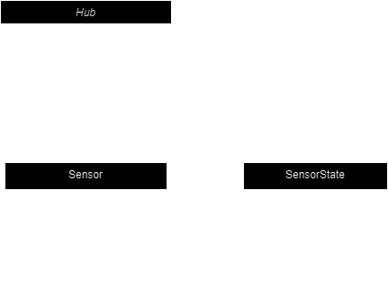

# Контрольная работа

## Логическая модель данных

Используется документоориентированная база данных (MongoDB)

## Архитектурная диаграмма

Взаимодействие можно описать так:
Hub:

- Data Consuming Service подписывается на события от датчиков, принимает от них данные.
- Data Reporting Service отправляет данные для обработки и формирования отчетов на удаленный сервер (API).
- Data Processing Service получает отчеты с удаленного сервера (БД MongoDB).
- Может временно хранить данные и отчеты. А также отчеты и данные могут храниться на удаленном сервере (БД MongoDB).
- Центр управления: Hub принимает данные от сенсоров.
- Принятие решений: На основе собранных данных Hub анализирует текущее состояние системы и может автоматически принимать
  решения или ожидать команды пользователя.

Датчики (Sensors):

- Датчики собирают данные о состоянии окружающей среды
- Датчики передают собранные данные по беспроводной технологии (например, Zigbee) хабу каждые 10 секунд.

Удаленный сервис:

- Report Service подписывается на события от датчиков, принимает от них данные.
- Database отправляет данные для обработки и формирования отчетов на удаленный сервер (API).
- API получает отчеты с удаленного сервера (БД MongoDB).

## Архитектура создания отчетов на реал-тайм данных

Этим занимается Data Consuming Service, получая данные в реальном времени от датчиков. Данные могут временно храниться
на самом Hub.

## Архитектура создания отчетов, время создания которых превышает 4 бизнес часа

Data Reporting сервис получает все данные за указанный период времени с удаленной БД.

## Логические слои данных

1. Слой получения данных (датчики)
2. Слой сбора данных (hub)
3. Слой обработки данных (сервер)
4. Слой хранения данных (бд или кэш в hub)
5. Слой визуализации данных (отчеты)

## Примеры

Отчет на реал-тайм данных

Долгосрочные отчет

